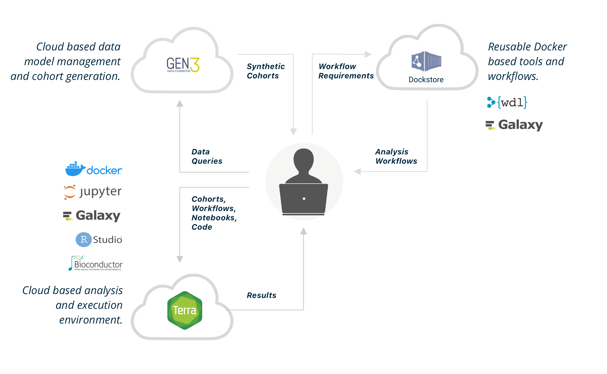

# Introduction to AnVIL

<hero small>AnVIL is a cloud based Data Commons that colocates high value data sets with commonly used bioinformatics tools in a secure environment.</hero>

By providing access to data and tools in a secure environment that can scale to meet the computational needs of researchers, AnVIL eliminates logistical concerns and allows researchers to focus on biological problems.
 
Providing access to such a platform with tens of thousands of human genome sequences will allow the genomics community to ask new questions that were not logistically feasible before.

## AnVIL is a Data Commons

AnVIL is a Data Commons that colocates data, computing resources and reusable analisys wworkflows in a managed cloud based environment.  As datasets grow larger and secure management of controlled access becomes increasingly critical cloud based data commons provide significant advantages over on premise environments.

### Benefits of the Cloud Based Data Commons Model

1. Users are not required to build and maintain secure data centers to work with controlled access data.
1. More...
1. More ...

## AnVIL's Components

AnVIL leverages the Terra computing platform to manage access and billing of cloud projects, launch analysis environments, and manage data.
 
Terra is integrated with the Dockstore workflow repository, enabling AnVIL users to utilize the library of published workflows in Dockstore.
 
Gen3 is leveraged by AnVIL as the data management system, enabling users to associate complex phenotypes, metadata, and clinical data with sequencing based data with sophisticated data models.

<Platforms></Platforms>

