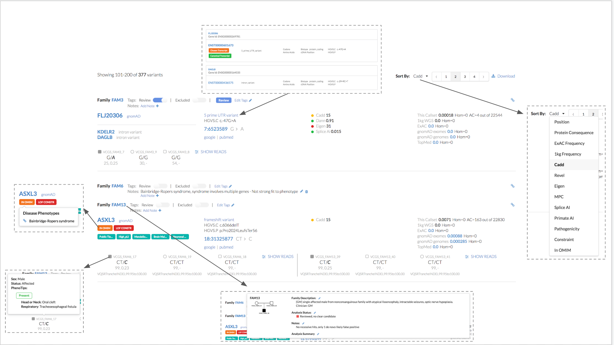
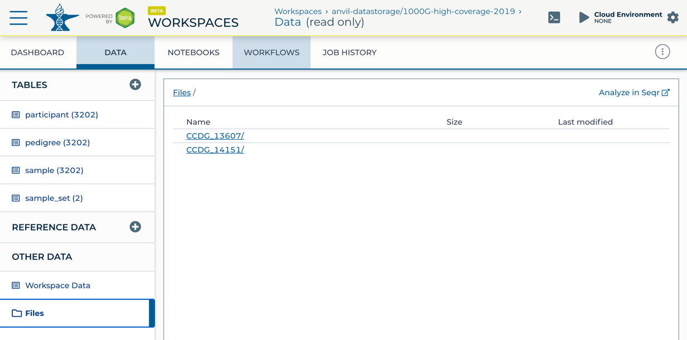

# Announcing Seqr Availability in NHGRI's AnVIL
##### Posted: March 10, 2021

The Broad Institute's [Seqr](https://seqr.broadinstitute.org/) is being launched today in
production within AnVIL to provide a platform for genomic data analysis for rare diseases. Broad's [Seqr](https://seqr.broadinstitute.org/) is an intuitive browser-based system
for analyzing rare disease exome and genome data on a family basis.

Seqr is an open-source tool supported by the Translational Genomics Group
at the Broad Institute that runs on Google Kubernetes Engine (GKE) and
data is loaded using Google Dataproc Spark clusters.

The production instance uses Postgres, which is a SQL database, to
store project metadata and user-generated content (e.g., variant notes)
and Elasticsearch to store variant callsets.

With the onset of key NHGRI datasets being ingested to AnVIL such as Center for Mendelian Genomics (CMG), 
Clinical Sequencing Evidence-Generating Research (CSER), and 
Transamerican Autoimmune Research Network (TARN), the availability of 
Seqr will enable researchers to analyze and annotate their data with Seqr in the AnVIL platform and collaborate with other investigators as they choose.

## Using Seqr in AnVIL
Researchers will need to bring their joint call files to the AnVIL to make use of Seqr. 
If a joint call file is needed, researchers can use [GATK tooling](https://anvilproject.org/learn/anvil-mooc/use-case-gatk), also available within AnVIL.  

To launch Seqr on a Terra workspace, navigate to the workspaces' "Data" tab, select the "Files" subtab, and select
 "Analyze in Seqr" in the top right of the page.

